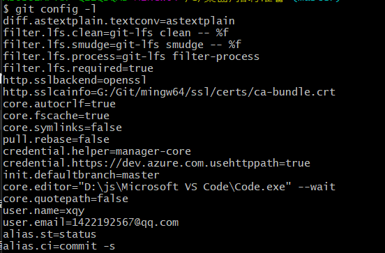
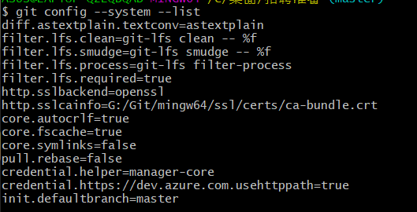
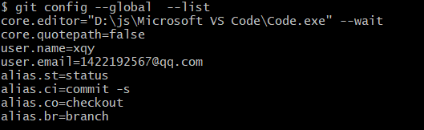
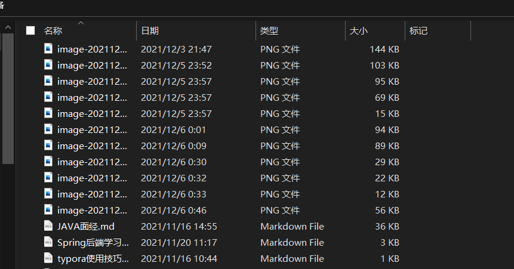
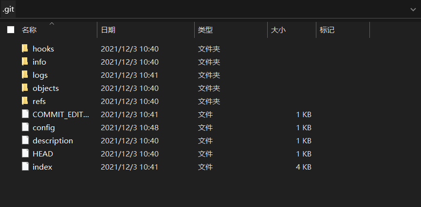

Git\etc\gitconfig

C\user\asua\gitconfig

git config -- global user.name "XXX"

# 核心

## 工作区域

- 工作目录 working directory
  - 本地文件
  - 
- 暂存区 stage
  - 是一个文件,用来保存即将提交到文件列表信息
  - .git
  - 
- 资源库 repository

远程git仓库 

