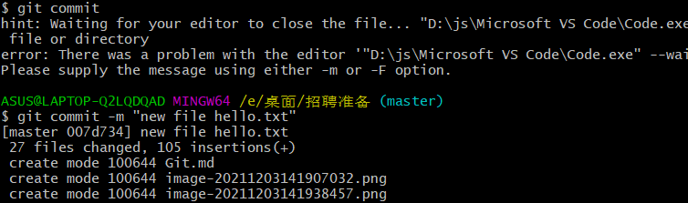

Git\etc\gitconfig

C\user\asua\gitconfig

git config -- global user.name "XXX"

# 核心

## 工作区域

参考：b站狂神

- 工作目录 working directory
  - 本地文件
  - 
- 暂存区 stage
  - 是一个文件,用来保存即将提交到文件列表信息
  - .git
  - 
- 资源库 repository
  - head
  - 

远程git仓库 (github gitee ...)

工作流程

1. 工作目录添加修改文件
2. 需要版本控制的放入暂存区
3. 暂存区提交到git仓库

## 命令

### git init 

### git clone [url]

## 状态

untracked 未跟踪

unmodify 入库、未修改

modified 仅已修改

staged 暂存

## 步骤

### 1.git add .

### 2.git commit -m“the message”

### 3.git remote add origin git@github.com:ren-qing/ren-qing-Data-management-and-shopping-websites.git

### 4.git push --set-upstream origin master 首次

###  如果仓库里已经上传过东西

### git config branch.master.remote origin

###  git config branch.master.merge refs/heads/master

### git pull origin master --allow-unrelated-histories

### git push

