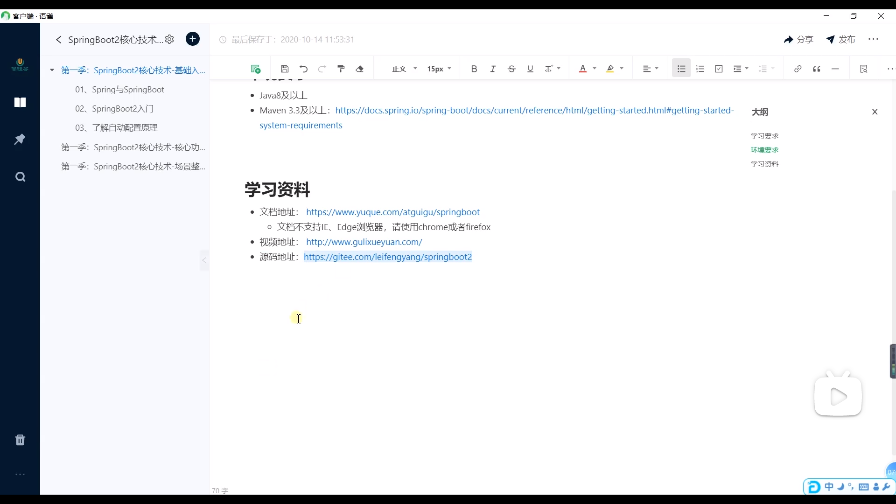

IOC 反转控制

sPring负责类的所有管理

bean是spring里的对象 

DI依赖注入

## 各个文件的理解

## 注解

方便管理Bean对象

目的是减少xml里配置。

### @Configuration

该类等价 与XML中配置beans，相当于Ioc容器，它的某个方法头上如果注册了@Bean，就会作为这个Spring容器中的Bean，与xml中配置的bean意思一样。

@Configuration用于定义配置类，可替换xml配置文件。被注解的类内部包含有一个或多个被@Bean注解的方法，这些方法将会被AnnotationConfigApplicationContext或AnnotationConfigWebApplicationContext类进行扫描，并用于构建bean定义，初始化Spring容器。

### @Value

### @Controller, @Service, @Repository,@Component

### @PostConstruct 和 @PreDestory

### @Primary

### @Lazy(true)

### @Autowired

### @Resource

### @Async

## 跨域问题

浏览器从一个域名的网页去请求另一个域名的资源时，域名、端口、协议任一不同，都是跨域

## **Serializable接口**

[参考文章](https://baijiahao.baidu.com/s?id=1633305649182361563&wfr=spider&for=pc)

一个对象序列化的接口，一个类只有实现了Serializable接口，它的对象才能被序列化。

序列化是将对象状态转换为可保持或传输的格式的过程。与序列化相对的是反序列化，它将流转换为对象。这两个过程结合起来，可以轻松地存储和传输数据。

当我们需要把对象的状态信息通过网络进行传输，或者需要将对象的状态信息持久化，以便将来使用时都需要把对象进行序列化

那为什么还要继承Serializable。那是存储对象在存储介质中，以便在下次使用的时候，可以很快捷的重建一个副本。

在Java中的这个Serializable接口其实是给jvm看的，通知jvm，我不对这个类做序列化了，你(jvm)帮我序列化就好了。

## 步骤

1.domain 类对应数据库

2.dao 定义方法

3.xml写sql语句

4.实现接口与接口的实现类

