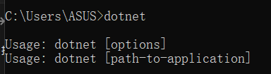
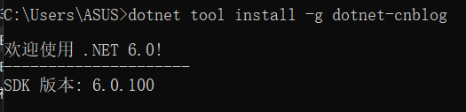
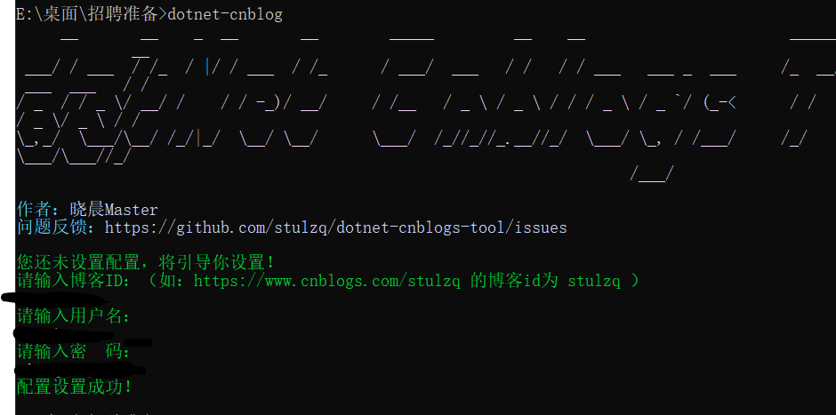
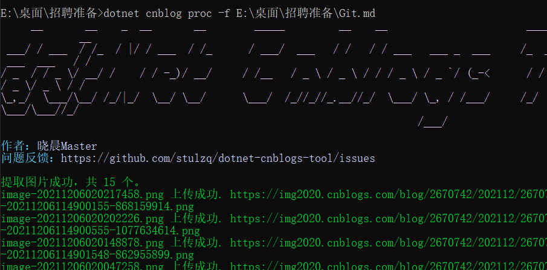

# python

## 强制转换没有double

## 文件夹

```python
for root, dirs, files in os.walk("./news_novals/sh/"):
    print(files) #当前路径下所有非目录子文件
    i = 0 
    for f in files:
        if i == 0 :
            df_ = dataAnalysis(root+f,0)
            
        else:
            df_2 = dataAnalysis(root+f,0)
            df_ = df_.append(df_2,ignore_index=True)
        
        i += 1
df_.to_csv("./news_novals_data/data.csv")
```

## 循环进度条

## pip3

[参考博客](https://www.jianshu.com/p/2f71e41450f7)


## .net

已成功安装。

下列项安装于: "C:\Program Files\dotnet\"
    • .NET SDK 6.0.100
    • .NET Runtime 6.0.0
    • ASP.NET Core Runtime 6.0.0
    • .NET Windows Desktop Runtime 6.0.0

此产品会收集用法数据
    • 详细信息和选择退出选项: https://aka.ms/dotnet-cli-telemetry

资源
    • .NET 文档: https://aka.ms/dotnet-docs
    • SDK 文档: https://aka.ms/dotnet-sdk-docs
    • 发行说明: https://aka.ms/dotnet5-release-notes
    • 教程: https://aka.ms/dotnet-tutorials

# dotnet cnblog

## 安装

官网安装



接下来命令行安装 dotnet tool install -g **dotnet-cnblog** 



## 1.配置

dotnet-cnblog



dotnet cnblog proc -f  文件地址（注意，如果图片进行过缩放将不能显示，所以不要缩放，如果要缩放要用width）



最后将生成的.md文件文本复制粘贴到博客园新建的笔记中
