# MVVM模式

model-view-viewModel 模型-视图-视图模型

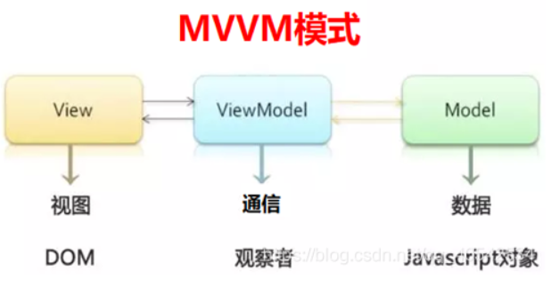

- 模型
  指的是后端传递的数据。

- 视图
  指的是HTML页面。

- 视图模型（ViewModel对象）
  是MVVM模式的核心，它是连接View和Model的桥梁，是一个同步View 和 Model的对象。
  它有两个方向：

  - 一是将模型转化成视图，即将后端传递的数据转化成所看到的页面，实现的方式是：数据绑定。

  - 二是将视图转化成模型，即将所看到的页面转化成后端的数据，实现的方式是：DOM事件监听。如果这两个方向都实现的，称之为数据的双向绑定。

  

  ViewModel 通过双向数据绑定把 View 层和 Model 层连接了起来，而View 和 Model 之间的同步工作完全是自动的，无需人为干涉。

  # MVC

  当DOM元素触发事件的时候，由js进行DOM元素的获取以及数据变化的收集，然后更新数据，操作DOM更改数据。当页面元素较多时，频繁进行数据交互将对维护和性能造成很大影响。

  # vue

  | 钩子函数      | 说明                                                         |
  | ------------- | ------------------------------------------------------------ |
  | beforeCreate  | 在Vue实例创建之前执行的函数                                  |
  | created       | 实例创建完成后调用。                                         |
  | beforeMount   | 在Vue实例创建之后，数据未渲染负责接管DOM之前执行的函数       |
  | mounted       | el挂载到实例上后调用，一般我们的第一个业务逻辑会在这里开始。 |
  | beforeDestory | 实例销毁之前调用。主要解绑一些使用addEventListener监听的事件等。 |
  | destroyed     | Vue实例在执行vm.destroyed()命令之后，销毁之后执行的函数      |
  | beforeUpdata  | 在Vue实例数据更新之前执行的函数                              |
  | updated       | 在Vue实例数据更新之后执行的函数                              |

  ​	
  ​	
  ​	
  ​	
  ​	
  ​	
  ​	
  ​	
  ​	

# axios

- 从浏览器中创建 XMLHttpRequests

- 从 node.js 创建 http 请求

- 支持 Promise API

- 拦截请求和响应

- 转换请求数据和响应数据

- 取消请求

- 自动转换 JSON 数据

- 客户端支持防御 XSRF

  

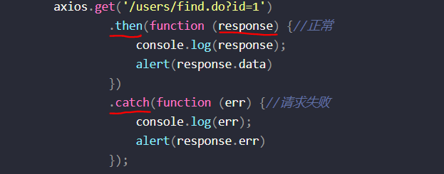

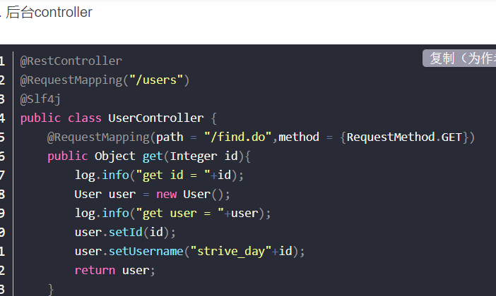

#  promise

# ES6

国际化标准组织 ECMA（European computer manufactures association，欧洲计算机制造联合会）

ECMAScript

是 JavaScript 的下一个版本标准

|      | ES5  | ES6  |
| ---- | :--: | :--: |
|      |  类  |      |
|      |      |      |
|      |      |      |

## 新增关键字

### let

let 声明的变量只在 let 命令所在的代码块内有效。var 是在全局范围内有效:

let 只能声明一次 var 可以声明多次。

变量提升

变量 b 用 var 声明存在变量提升，所以当脚本开始运行的时候，b 已经存在了，但是还没有赋值，所以会输出 undefined。

变量 a 用 let 声明不存在变量提升，在声明变量 a 之前，a 不存在，所以会报错。

### const

const 声明一个只读变量，声明之后不允许改变。意味着，一旦声明必须初始化，否则会报错。

其实 const 其实保证的不是变量的值不变，而是保证变量指向的内存地址所保存的数据不允许改动。此时，你可能已经想到，简单类型和复合类型保存值的方式是不同的。是的，对于简单类型（数值 number、字符串 string 、布尔值 boolean）,值就保存在变量指向的那个内存地址，因此 const 声明的简单类型变量等同于常量。而复杂类型（对象 object，数组 array，函数 function），变量指向的内存地址其实是保存了一个指向实际数据的指针，所以 const 只能保证指针是固定的，至于指针指向的数据结构变不变就无法控制了，所以使用 const 声明复杂类型对象时要慎重。

# vuex

## 安装

## 使用

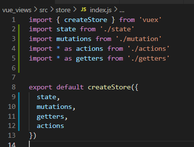

## state.js

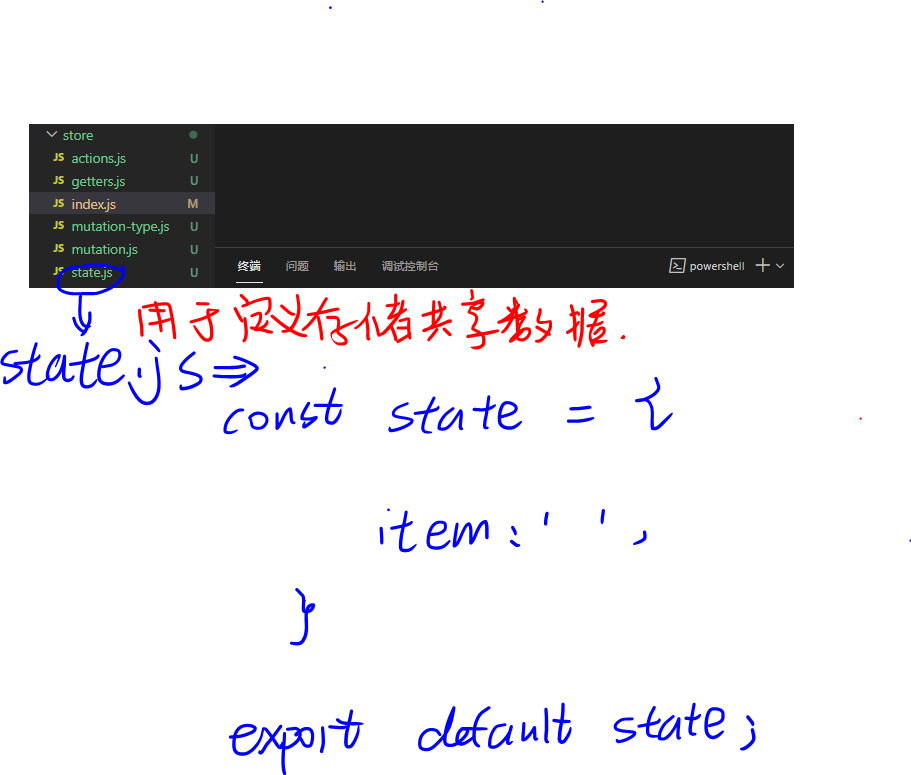

## getters.js

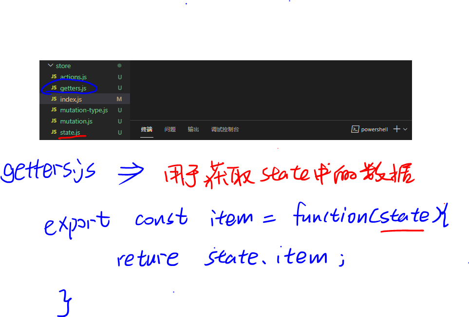

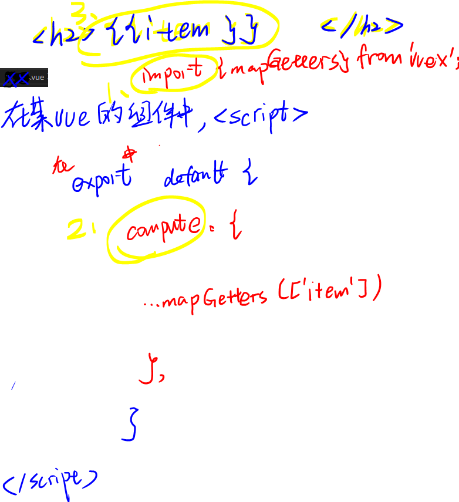

或者$store .state.item

getters 使得获取数据更方便

## mutation-type 与 mutation

type 用来陈列所有方法

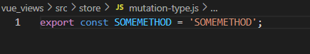

mutation用来具体实现

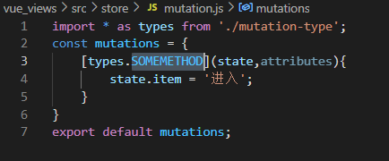

具体的vue中，scriipt中import store 马屁mutations 

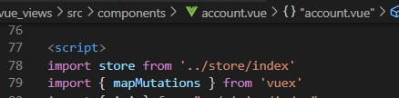

方法中使用 `mapMutations` 辅助函数将组件中的 methods 映射为 `store.commit` 调用（需要在根节点注入 `store`）。

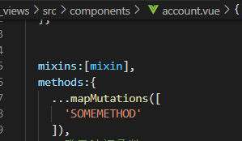

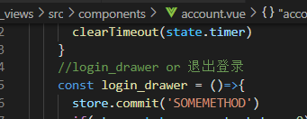

# 

