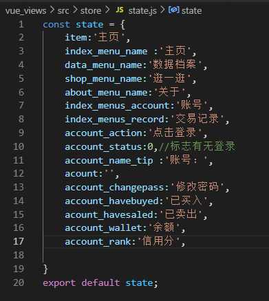
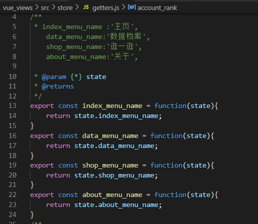
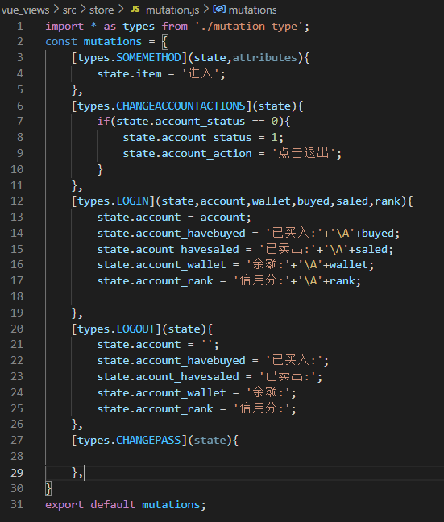

## 1.vuex 数据声明 初始化

## 2.vuex getter实现

## 3.vue中引用绑定

<template>
    {{index_menu_name}}
</template>

## 4.mutation 事件编写

## 5.事件引用触发

commit

## 6.spring后端编写步骤

domain-》XXXController（编写具体接口）-》XXXService (功能接口)-> XXXServiceImpl(接口的具体实现)-》XXXMapper(相关类的DAO)-》XXXMapper.xml（数据库对接实现增删改查）

