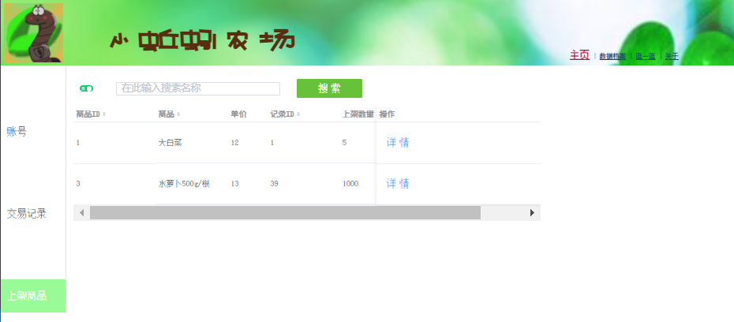
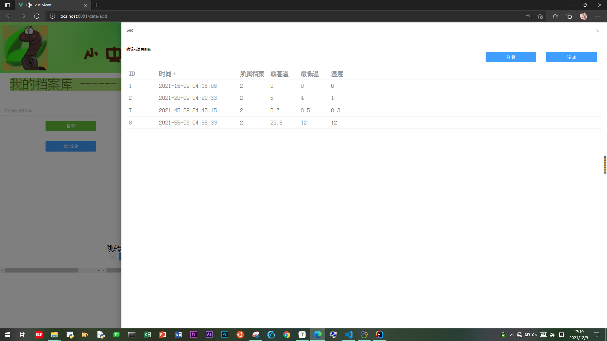
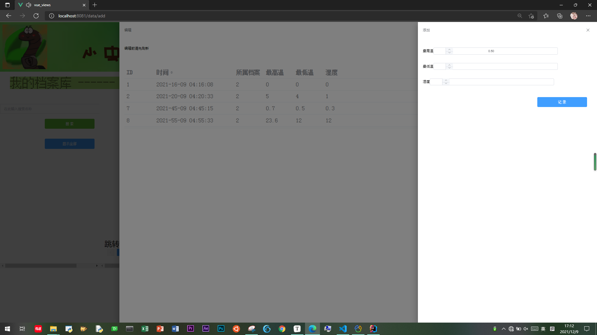

## 1.vuex 数据声明 初始化


## 2.vuex getter实现


## 3.vue中引用绑定


<template>
    {{index_menu_name}}
</template>


<script>
    import { mapGetters } from "vuex";
    export default {
  		computed:{
			...mapGetters(['item','index_menu_name','data_menu_name','shop_menu_name','about_menu_name'])
  		}
	}
</script>

## 4.mutation 事件编写


## 5.事件引用触发

commit

## 6.spring后端编写步骤

domain-》XXXController（编写具体接口）-》XXXService (功能接口)-> XXXServiceImpl(接口的具体实现)-》XXXMapper(相关类的DAO)-》XXXMapper.xml（数据库对接实现增删改查）


## 数据库


### 清空所有数据MySQL数据库自增主键归零

```
use database
truncate table table_name;
```


## 总共有四个分页


### 主页

主页中有三个小模块


#### 	账号（已完成）**用户的余额充值由管理员进行**

​		账号页面通过抽屉drawer可以进行登录、注册、修改密码、退出登录的操作。该模块在每次加载时都会触发后端，显示账号、已买入、已卖出、余额、信用分的数据，其中已买入、已卖出、余额、信用分通过鼠标悬浮显示出来，保护隐私。通过重新进入该页面就可以实现加载。


#### 	交易记录（**档案记录的详情展示**）

​		在交易记录页面可以展示作为出售方和买入方不同角色的交易数据。对每个交易都可以进行查看商品详情以及评价操作。评价只可执行一次，否则无法评价，会给予用户提示。展示还可以进行排序操作。分页、买入和卖出的不同响应、根据商品名称搜索。


#### 	上架商品（**查看商品的售后情况**）

​		在上架商品的页面，可以查看自己出售过的或正在出售的商品。通过点击详情页面可以查看商品的售后情况。分页、根据商品名称搜索。点击下架下架商品。



### 数据档案（**分析（档案记录的详情展示、图表展示）**）

​	可以查看自己的所有档案列表，添加档案、执行出售（发布商品）、删除档案（改档案所有者为admin）、编辑（导入详细数据）、分析（档案记录的详情展示）、搜索。






### 逛一逛（**分析（档案记录的详情图表展示）**、）

​	可以通过商品名称搜索，可以点击详情展示、购买、通过商品名称搜索展示table、购买（有检验、有提示）相应的会从余额里扣钱，和给对方账户打钱。


### 管理员

​	给管理员一些权限。管理员处理售后（展示、批准），充值与提现。

### 档案数据详情的图表展示，商品售后的图表展示

### 假删

用户的余额充值由管理员进行

刷新存储


# 后续提升 

模型

外键--关联关系--删除--数据库


