# 导论

## 计算机网络定义

## 拓扑结构

## 重要协议

## 层次结构

## 带宽、传输速率

## ISO

## TCP/IP

## 通信子网

## 计算机网络的实验

## 交换机实验2

华为交换机：

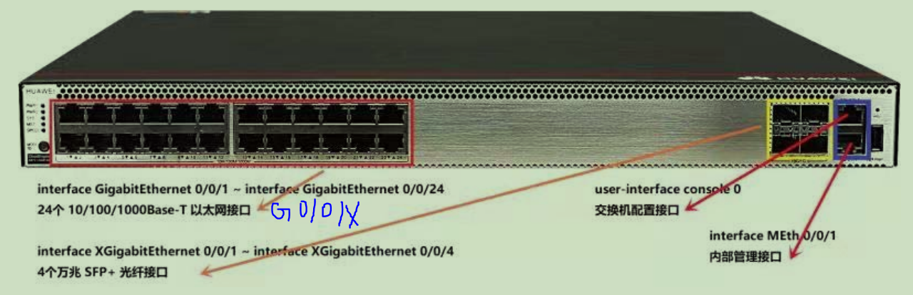

拓扑结构：如下图连线--五根线 还有console线连接电脑A与交换机

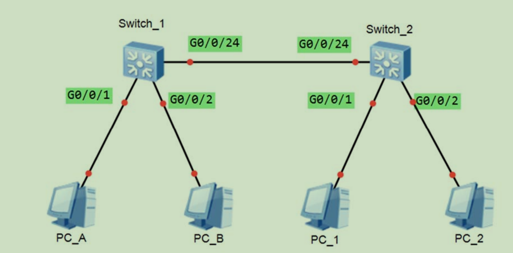

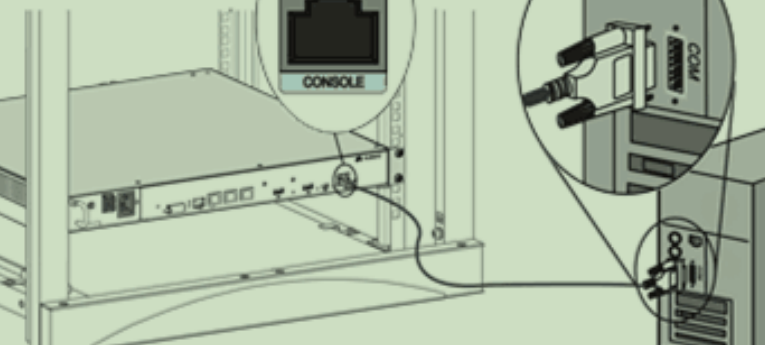

cmd命令：

ipconfig /all

查看该电脑的IP地址和MAC地址

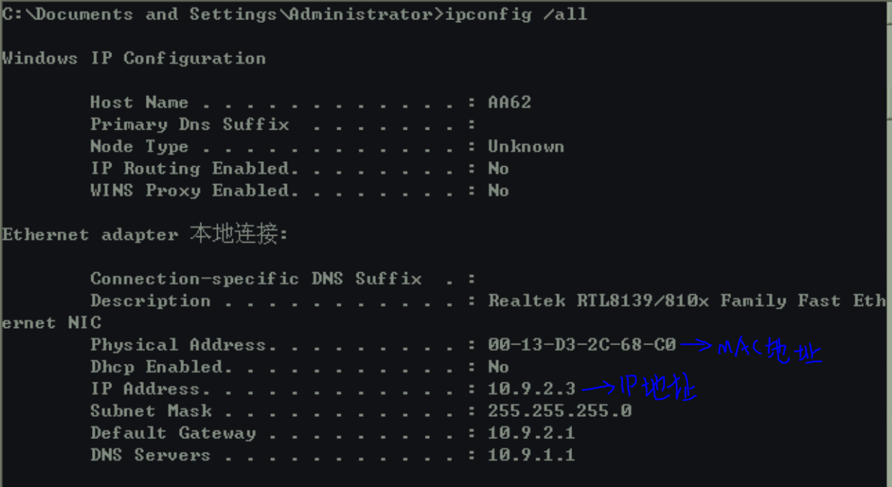

### 启动超级终端

需要进行以下操作

1. 区号：0571 确定
2. 确定
3. 新建连接名称：huawei 确定
4. 连接时使用 COM1 确定
5. 9600 8 无 1 无 确定
6. 连接接线板电源开关

### 交换机启动完成后，输入命令行（主要是查看）

1. 回车
2. username：admin
3. password：admin@huawei 
   1. 用户视图<>
4. system-view
   1. 系统视图[ ]
5. display version 查看系统版本
6. display current-configuration 查看交换机配置
7. display interface g0/0/1 查看端口参数 （Duplex:FULL全双工 Speed：1000速率）
8. display mac-address 查看交换机的MAC地址
9. display bridge mac-add 查看本交换机MAC地址

### 配置命令（主要是修改）

1. sysname  switch_1 (**改交换机1的名字**)
2. int vlan1 (interface **以下设置交换机的IP地址**)
3. ip address 172.21.12.254 255.255.255.0 (或者ip address 172.21.12.254 24)
4. quit
5. int g0/0/10(**进入接口设置状态**)
6. undo negotiation auto(修改之前此命令可以进行后面的修改、否则会报错)
7. speed 100(**改速率**)
8. duplex half(**改全双工与半双工**)
9. quit
10. display interface g0/0/10
11. ping 用来验证通不通

### 新增vlan命令

1. vlan 2 (**新增vlan2)**
2. quit
3. int g0/0/2 (以下操作将2号口移入VLAN2)
4. port link-type access
5. port default vlan 2
6. quit
7. int g0/0/24 (以下命令将24号口设为trunk)
8. port link-type trunk
9. port trunk allow-pass vlan all
10. quit
11. display vlan

## 路由器基本配置实验

华为路由器：

### 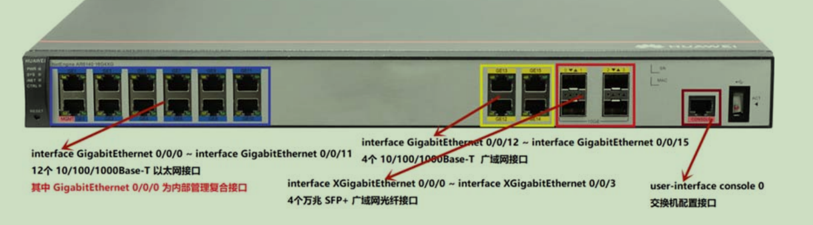

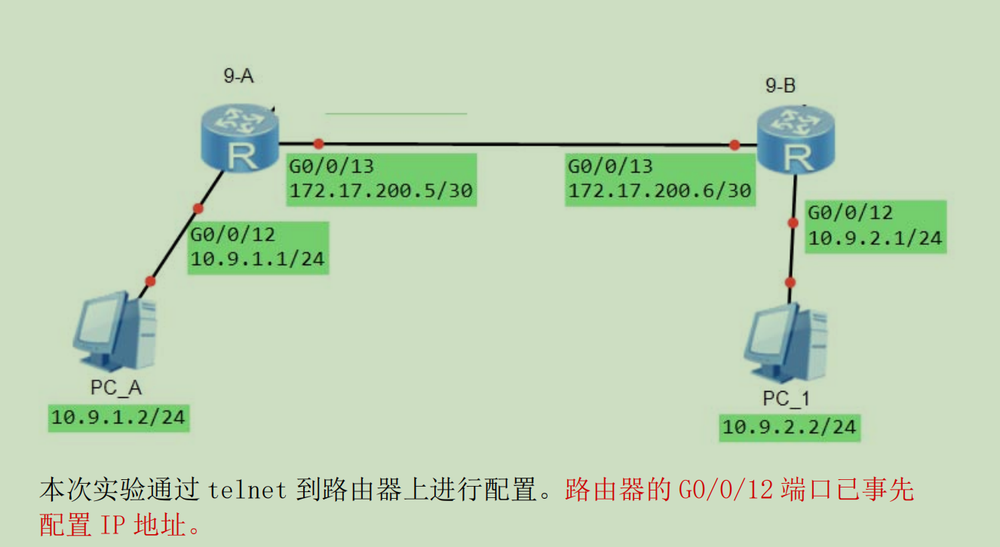

### 配置计算机IP地址

1. 本地连接--属性--Internet协议 （TCP/IPv4）
2. 配置IP参数 10.X.1.2  255.255.255.0 10.X.1.1
3. 确定--关闭

### 超级终端

1. 连接时使用 TCP/IP(Winsock)
2. 主机地址：10.X.1.1（G0/0/12的IP地址）  端口号 23
3. 确定
4. username: admin123
5. password: Huawei@123

? 调出help

undo 删除某项设置 禁用某功能

### 配置系统时间

1. system-view
2. display version
3. display current-configuration
4. display interface brief (查看所有接口)
5. sysname 9_A (命名路由器)
6. 激活端口
   1. interface GigabitEthernet 0/0/13
   2. ip address ......... 30
   3. undo shutdown
7. display this
8. ping....

## 路由器基础

IP地址分类：

- A类
  - 一般用于大型网络
- B类
  - 一般用于中等规模网络
- C类
  - 一般用于小型网络
- D类
  - 一般用于多路广播用户
- E类
  - 保留地址

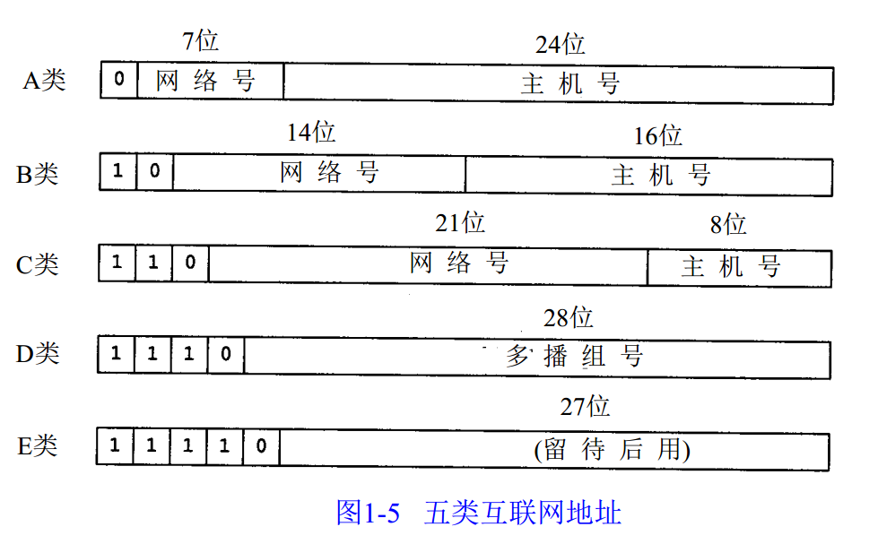

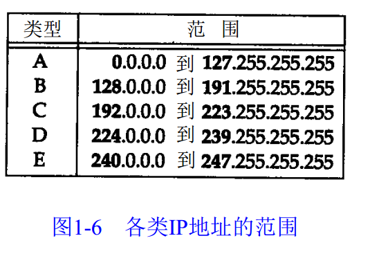

主机地址

子网掩码

网络号

广播地址

IP分配

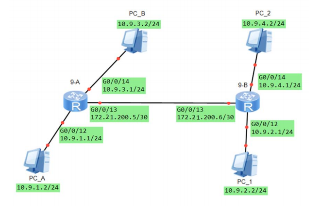

设置计算机的相应参数

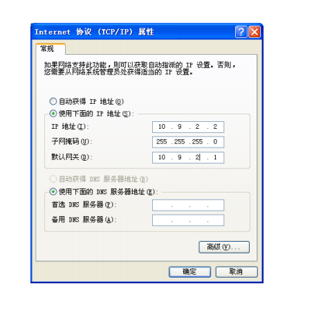

配置路由器

1. 登录
   1. admin123
   2. Huawei@123
2. 系统视图
   1. system-view
3. 配置A的 G0/0/13端口IP
   1. interface GigabitEthernet 0/0/13
   2. ip address 172.21.200.5 30
   3. undo shutdown
   4. quit
4. 配置A的 g0/0/14端口的IP
   1. interface GigabitEthernet 0/0/14
   2. ip address 10.9.3.1 24
   3. undo shutdown
   4. quit
5. 检查A配置
   1. display current-configuration

### 设置静态路由

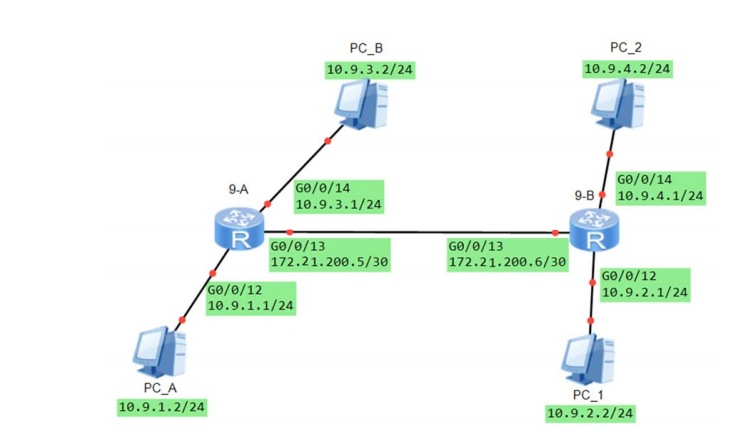

设置静态路由

1. ip route-static 10.9.2.0 255.255.255.0 172.21.200.6
2. ip route-static 10.9.4.0 255.255.255.0 172.21.200.6

检查9-A上的路由表

display ip routing-table

## 

## 静态路由

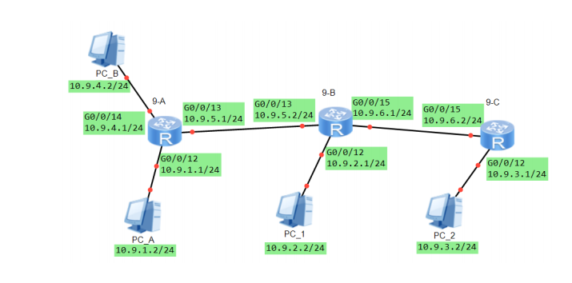

1. 设置参数
   1. 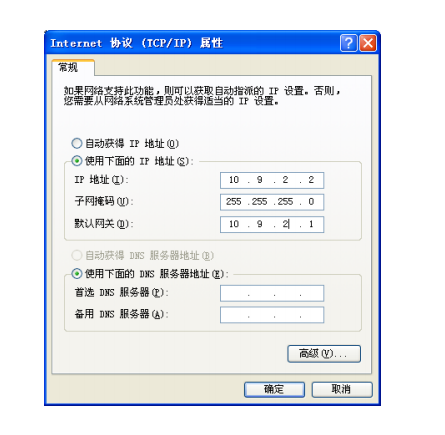
2. 进入终端
3. 配置路由器端口 设置IP 并激活
   1. interface GigabitEthernet 0/0/13
   2. ip address 10.9.5.1 24
   3. undo shutdown
   4. quit
4. 设置静态路由
   1. ip route-static 10.9.2.0 255.255.255.0 172.21.200.6

集线器 物理层

