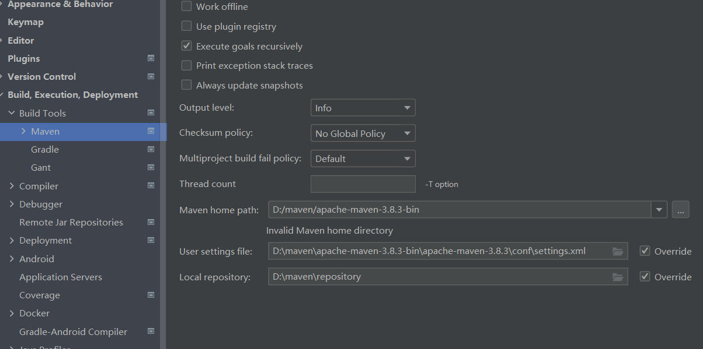
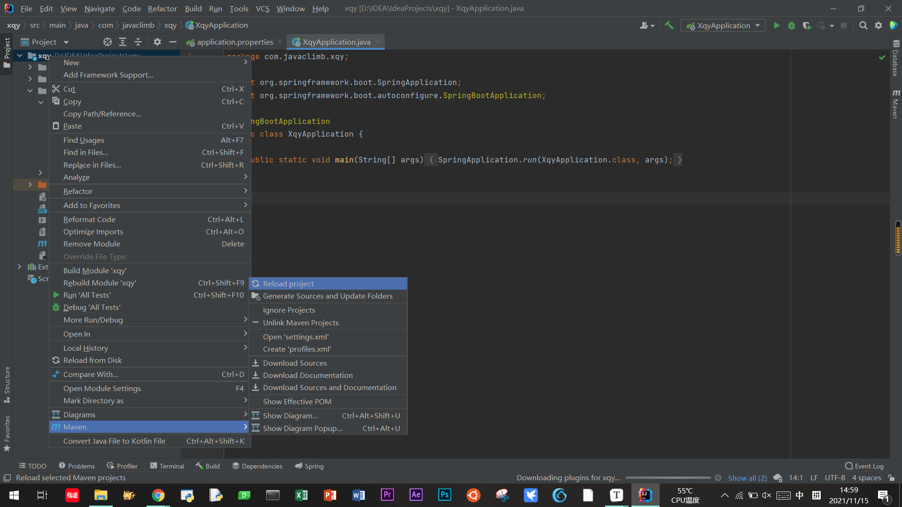
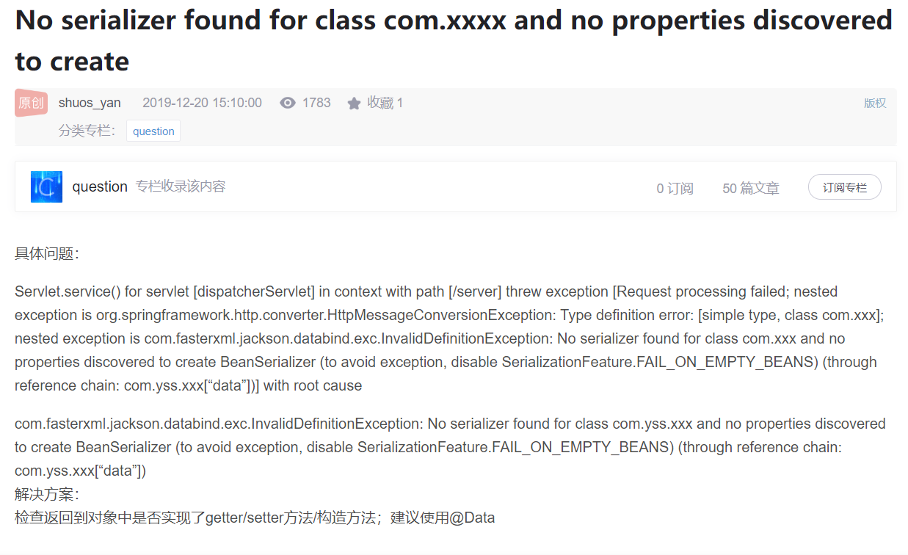
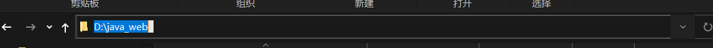
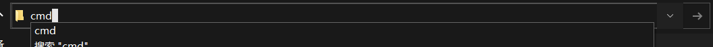
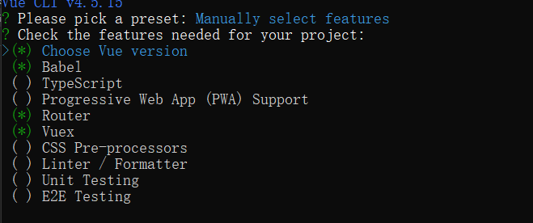
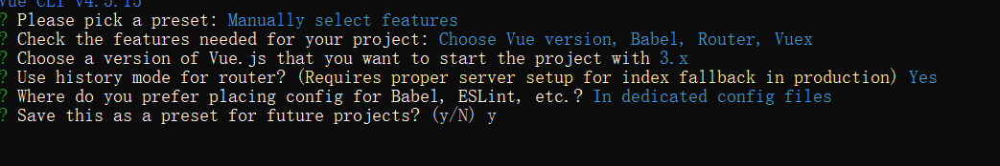
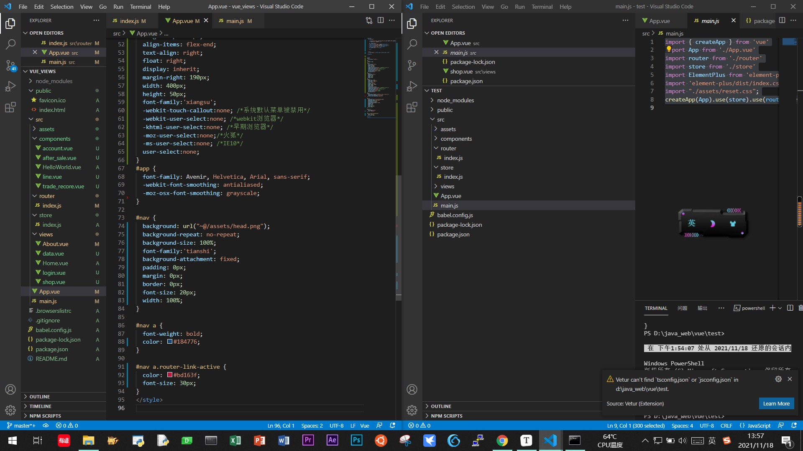
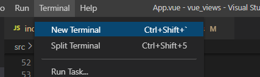
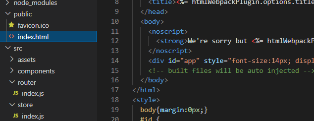

# Spring IDEA

## 错误1：导包报错问题

问题描述：java: 程序包org.springframework.boot不存在

解决方法：	

IDEA太慢了实在是 导包总是出问题 能把我卡死 暴躁

还有一个就是很奇怪的 setting里面的 maven设置路径我之前设置过，今天打开搞了半天原来是路径被改成原始的了。这里改一下就好了。刚刚有设置错了，大文件夹小文件夹，我加的很深。

查包官网：https://mvnrepository.com/search?q=spring-boot-starter-parent

所有的包都可以查询，版本号，复制，导入修改后，右击项目--maven--reload，实在不行关闭IDEA，重新打开。







# vue3

## 错误1 'vue-cli-service' 不是内部或外部命令，也不是可运行的程序

今天本来想调整一下项目的目录结构，ctrl+x了一下，立马就想shift+delete，还好反应的还算及时，我的页面的代码还有，就是vue的配置的一些文件没了，比如 package.json。立马点暂停，ctrl+v回去，用vscode打开项目发现报错 ： 'vue-cli-service' 不是内部或外部命令，也不是可运行的程序。npm install -g @vue/cli-service了一下，继续npm run serve.继续报错Error: Cannot find module '@vue/cli-plugin-babel'。想着可能还有文件给我删坏了，所以索性直接再创一个项目，把前端的代码copy过去。

顺便记录一下我现在的创建前端项目步骤：

1. win+r cmd 开终端 也可以在文件夹目录上输入cmd 我选后面一种 话说一个vue框架东西真大啊，删一个都要好久





​	2.vue create [vuename] 

选择手动manual 勾选一下的 在到Choose Vue version 按回车





3.手动改 win+← →分屏操作



4.新建终端跑一跑试试



对了，vue的项目用用element的时候，每个项目都要npm install element-plus --save 要不然页面的元素显示不出来。

就是这样的拯救回来了，要不然两个周末白忙活。

## css 一些页面布局设计的常用技巧

### 去除网页边上的空白

```css
<style>
body {
    margin:auto;  或者margin：0px;
}
</style>
```



## 后端 mapper

打错了url浪费了我一晚上的时间

还好最后还是找到错误了 现在是晚上10点，这就去写白本书

### POST  500

后端错误 看后端报什么错

### POST 404

我的baseURL设置

## 
